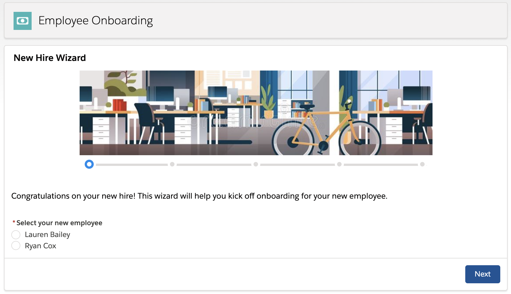

## rc-new-hire-wizard

This has a New Hire Wizard for demos. Nothing happens at the end of it. The employees to select to onboard come from a look up for Contacts that have 'Employee Status' = 'New Hire'. The onboarding mentors to select come from a look up on Users who have the 'Is Guide' checkbox set to true.

## Development

To work on this project in a scratch org:

1. [Set up CumulusCI](https://cumulusci.readthedocs.io/en/latest/tutorial.html)
2. Run `cci flow run dev_org --org dev` to create a scratch org, configure the dependent Nonprofit Success Pack and Volunteers for Salesforce packages, and deploy this project. 
3. Run `cci org browser dev` to open the org in your browser.